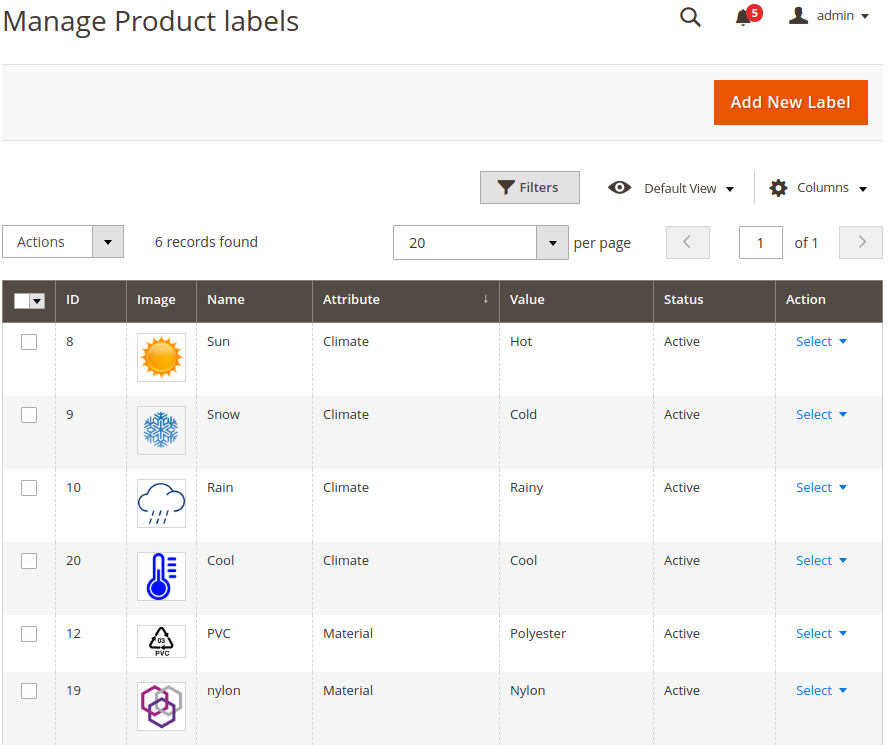
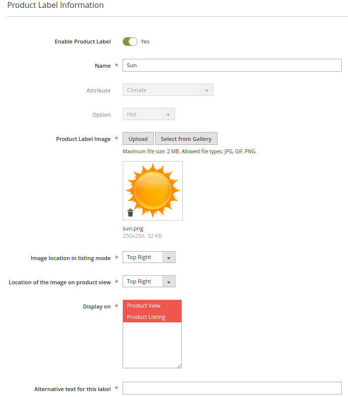
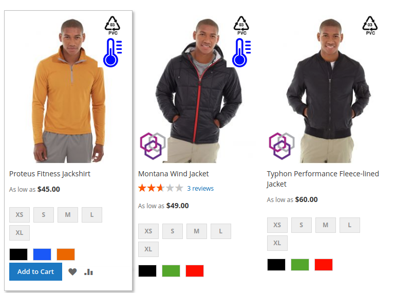
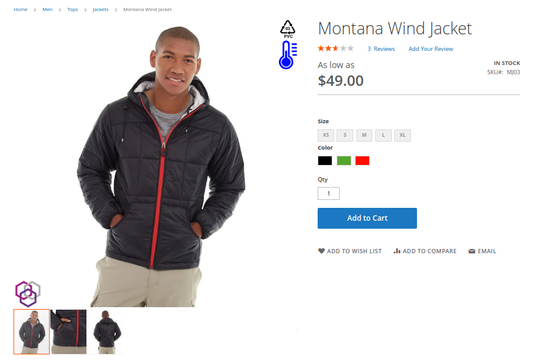

Product Label Management
========================

## What is Product Label Magento 2 Module?

This module allow possibility to create and manage custom product labels that are linked to specific attributes values and  to display them in front  

## Who is developing this module ? 

This module is built by Smile. 

Smile is the **European leader of Open Source** and also a four-times **Europe Partner of the the Year** (2010-2014), two-times **Spirit of Excellence** (2015-2016), **Global Elite Partner** (2017-now), and **Regional Commercial Partner** (2018) awarded by Magento.

Our multidisciplinary team brings together experts in technology, innovation, and new applications.

Together we explore, invent, and test technologies of the future, to better serve our clients.

## Main Features

### Create Product Labels

* **Product Labels:**

This module allows you to **create product labels** associated with an existing Attribute value.

* **Create a Product Label:**

You can create as many entity types as you need

### Product label on front

* **Product labels are displayed in Product Listing and Product Details pages.**

## Documentation

Documentation is available [here](https://github.com/Smile-SA/magento2-module-product-label/wiki).

The User Guide is also available on PDF format [here](https://github.com/Smile-SA/magento2-module-product-label/wiki/static/UserGuide.pdf)

## Standards & Code Quality

Built on top of Magento2, our module respects all its prerequisites and code quality rules.

You can also find our PHPCS Standards and PHPMD rulesets in the module directory.

The module is also continuously tested on :

Tools                           | Results
------------------------------- |------------
Code Climate                    | 
Travis                          | 
